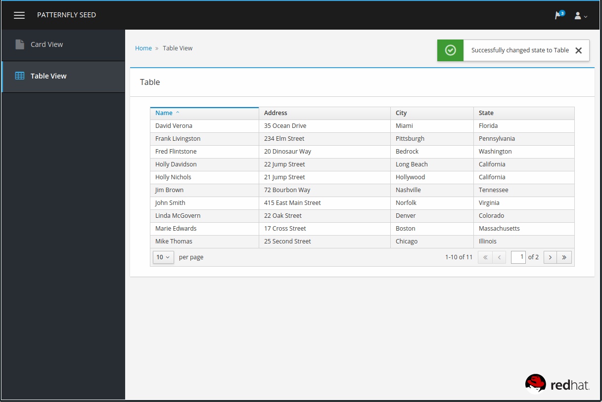

# patternfly-seed 
Patternfly Angular Seed project.  This project provides the infrastructure for development, livereload, code validation and production optimizations for deployment.

Referenced projects:

[PatternFly](http://www.patternfly.org/)

[Angular PatternFly](http://www.patternfly.org/angular-patternfly)

## Install
If you do not have grunt already installed do

`npm install -g grunt-cli`

Then to grab the server and web dependencies

`npm install`

`bower install`

## Local Dev
`grunt`

which defaults to the development task `grunt dev`

This task will [eslint](http://eslint.org/) your Javascript and also serve a local site on `localhost:9001`.  In addition it will watch and live reload changes to your application

You can edit the server options in `Gruntfile.js` under the **connect** task configuration

## Production Build

To do a production build that **eslints, concats, minifies and uglifies** Javascript and CSS, run the following task

`grunt build`

The generated site and assets will be in the **dist** folder

## Run the production build

To serve the production build run the following task

`grunt prod`
